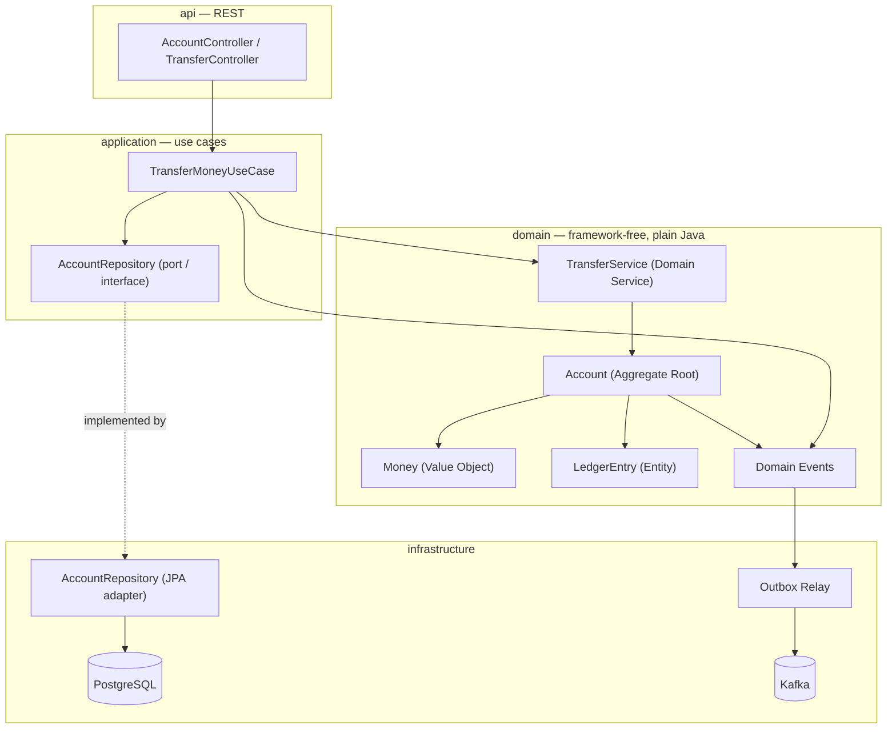

# core-ledger

A double-entry bookkeeping core banking ledger and money transfer service. Built with DDD tactical patterns and a
hexagonal (ports & adapters) architecture, it applies the real working principles of a banking ledger — immutable
records, idempotency, event sourcing, the outbox pattern, optimistic locking — at a small scale, but done properly.

## Why this project?

A ledger has one job: **never lose or duplicate money**, and always stay auditable while doing it. This project builds
that guarantee from the ground up — the focus isn't distributed-transaction complexity (Sagas etc.), it's **accounting
correctness**.

## Architecture

Hexagonal (ports & adapters): the domain layer has no framework dependencies, and dependencies flow inward, not outward.



**Layers:**

- **`domain`** — `Money`, `AccountId`/`TransactionId`/`IdempotencyKey` (Value Objects), `LedgerEntry` (Entity),
  `Account` (Aggregate Root, where invariants are enforced), `TransferService` (Domain Service), domain events, and
  domain exceptions. Fully independent of Spring/JPA — plain Java.
- **`application`** — use cases such as `TransferMoneyUseCase`; idempotency checks, orchestration. Repository *ports* (
  interfaces) are defined here.
- **`infrastructure`** — the actual implementations of those ports: the PostgreSQL/JPA adapter, the outbox relay, the
  Kafka producer.
- **`api`** — REST controllers and DTOs. Domain objects never leak out through this layer.

## Running it

```bash
mvn spring-boot:run
```

Requires Java 21+ and Maven.