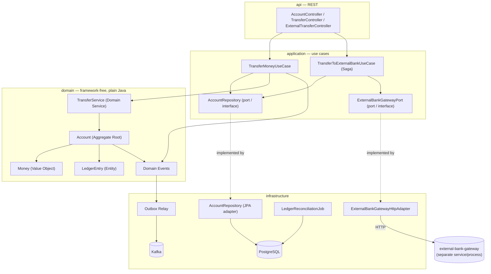

# core-ledger

A double-entry bookkeeping core banking ledger and money transfer service. Built with DDD tactical patterns and a
hexagonal (ports & adapters) architecture, it applies the real working principles of a banking ledger — immutable
records, idempotency, event sourcing, the outbox pattern, optimistic locking — at a small scale, but done properly.

## Why this project?

A ledger has one job: **never lose or duplicate money**, and always stay auditable while doing it. This project builds
that guarantee from the ground up — the core focus is **accounting correctness**, not distributed-transaction
complexity. As a stretch goal, it also demonstrates the Saga pattern: transfers to
[`external-bank-gateway`](../external-bank-gateway) (a second, independently deployed bounded context simulating a
real third-party bank) use a Saga with a compensating transaction instead of a shared DB transaction, since the two
systems can't share one.

## Architecture

Hexagonal (ports & adapters): the domain layer has no framework dependencies, and dependencies flow inward, not outward.



**Layers:**

- **`domain`** — `Money`, `AccountId`/`TransactionId`/`IdempotencyKey` (Value Objects), `LedgerEntry` (Entity),
  `Account` (Aggregate Root, where invariants are enforced), `TransferService` (Domain Service), domain events, and
  domain exceptions. Fully independent of Spring/JPA — plain Java.
- **`application`** — use cases such as `TransferMoneyUseCase` and `TransferToExternalBankUseCase`; idempotency
  checks, retry, and Saga orchestration. Repository/gateway *ports* (interfaces) are defined here.
- **`infrastructure`** — the actual implementations of those ports: the PostgreSQL/JPA adapter, the outbox relay, the
  Kafka producer, `LedgerReconciliationJob`, and `ExternalBankGatewayHttpAdapter` (calls the separate
  `external-bank-gateway` service over HTTP).
- **`api`** — REST controllers and DTOs. Domain objects never leak out through this layer.

## Running it

### Docker (recommended — brings up Postgres + Kafka + the app together)

```bash
docker network create bank-network   # once, shared with external-bank-gateway
docker compose up --build
```

The external-transfer flow (`TransferToExternalBankUseCase`, Saga + compensation) needs
[`external-bank-gateway`](../external-bank-gateway) running too, on the same `bank-network`:

```bash
cd ../external-bank-gateway
docker compose up --build -d
```

Without it, everything except `POST /api/transfers/external` works fine — that endpoint will fail with a connection
error until the gateway is reachable at `http://external-bank-gateway:8081` (see its own `docker-compose.yml`).

### Locally (Maven)

```bash
mvn spring-boot:run
```

Requires Java 21+, Maven, and a local PostgreSQL + Kafka reachable per `application.yml` (or override via env vars,
same as the Docker setup does).

## API docs

Swagger UI: `http://localhost:8080/swagger-ui/index.html`
Raw OpenAPI spec: `http://localhost:8080/v3/api-docs`

## Observability

`TransferMoneyUseCase` and `TransferToExternalBankUseCase` publish Micrometer metrics (attempt counters by outcome,
duration timers), scraped from `/actuator/prometheus`. Brought up automatically by `docker compose up` alongside the
app:

- Prometheus: `http://localhost:9090`
- Grafana: `http://localhost:3000` (login `admin` / `admin`) — a `core-ledger` dashboard is auto-provisioned with
  transfer throughput, latency, and error-rate panels.